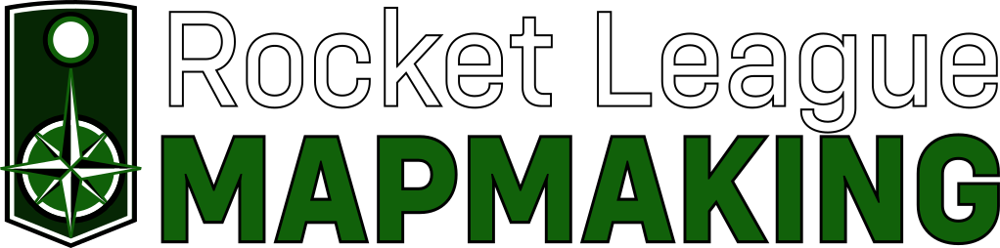

<!-- markdownlint-disable-next-line MD041 -->

# Rocket League Mapmaking Website Documentation

[][github-actions]
[][domain]
[][dev-domain]
[][package.json]

- Guide by Mr Swaggles
- Site design by ghostrider-05
- Webdev trickery by wejrox

## Deployment

**NOTE**: These steps will currently only work for the main `rocketleaguemapmaking.com` domain, as it hasn't been made
customisable yet. If you wish to view this branch or a PR locally, open the [developer site][dev-domain] or the url in the PR.

This site can be executed as a docker container on the host machine.

1. [Install Docker-CE](https://docs.docker.com/engine/install/) on the host machine. Docker (non-ce) should also work but is not tested.
2. Clone this repository.
3. Build image not on host with `docker build . -t rocketleaguemapmaking/rlmm:<VERSION>`
4. Push to dockerhub with `docker login; docker push rocketleaguemapmaking/rlmm:<VERSION>`
5. Navigate into the root of the repository on the host.
6. Execute `sh deployment/update_and_deploy.sh <BUILD_VERSION>`, e.g. `sh deployment/update_and_deploy.sh 0.1.0` on host
    - This container will run in the background, and you can access the website.
    - To view all docker containers, execute `docker ps -a`, which are ordered by age.
    - To view the NGINX logs of a container, execute `docker logs <container_name>`.
    - To stop the service, execute `docker stop rlmm`
7. Access the site at the correct URL (`rocketleaguemapmaking.com`).

## Contributing documentation

Read the [contribution][contributing] documentation for guidelines when contributing.

## Certificate Renewal

The certificate is renewed by the `renewcert.sh` script run using a cron job.

[contributing]: ./CONTRIBUTING.md
[package.json]: https://github.com/RocketLeagueMapmaking/RL-docs/blob/master/package.json
[github-actions]: https://github.com/RocketLeagueMapmaking/RL-docs/actions
[domain]: https://rocketleaguemapmaking.com
[dev-domain]: https://rocketleaguemapmaking.pages.dev
