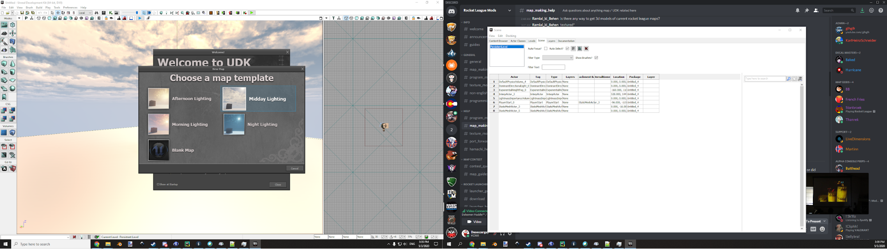

# Project setup

## Overview

UDK is from a different era of software project development, so it doesn’t have a lot of the nice features (or the look) that we have grown accustomed to. It can be a bit of a bear to navigate and understand, so the next few sections will be a walkthrough of how you should set it up.

## Folder Setup

I am on Windows, so please keep that in mind through the entirety of this guide.

* My Rocket League install location is `C:\Games\SteamApps\common\rocketleague`
  * All Rocket League assets live inside `\TAGame\CookedPCConsole`
      * Several of my modded maps live inside `\mods`, a folder I created
`C:\Games\SteamApps\common\rocketleague\TAGame\CookedPCConsole` will be referred to as `{CookedPCConsole}` for simplicity.

* As mentioned in the [UDK install process](), everything will live inside `{UDK Folder}`
    * **Each individual custom map should live inside a folder within `{UDK Folder}\UDKGame\Content\Maps\`**
    * In addition to these folders, I highly highly recommend making two Windows File Explorer shortcuts, or bookmarking these locations
      * One that points to `{CookedPCConsole}`
      * One that points to the Steam Workshop folder for Rocket League. This may be found in the Steam install location (the first half of `{CookedPCConsole}`), but instead of `\rocketleague\` it will be `\workshop\content\252950\`. Each downloaded map has a custom identifier in here, and it can be incredibly valuable to open them up in UDK and see how things are made.
      * Keep these within the `\Maps\` folder
	
* Within `C:\UDK\` I also have a folder named `Assets`. This is where I keep Blender projects, exported meshes, custom textures, screenshots, and whatever else (each within a categorized folder) that I might want to have easy access to.
* Also within `C:\UDK\` I keep a folder called `Workshop`, within which I have a folder for each map. See the section titled Publishing a Map for more information.
* All other programs and utilities, like [UE Viewer](), [Bakkesmod](), and [miscellaneous downloads](), live in their own folder outside of the UDK install. You can keep them here too if that makes more sense.

::: tip
I highly recommend creating folder shortcuts between all of these places, because it’s easy to get lost.
:::

## Starting a new project

When you run UDK Editor, you will be faced with a welcome splash screen and a few options.

*A nice day to be a cube on a platform in an infinite void*

If you want to have an animated skysphere around your world, use one of the Lighting templates. If you just want an entirely clean slate, go with the Blank Map option.

After making the project, save it in a new folder inside `{UDK Folder}\UDKGame\Content\Maps\`

It is no problem at all to change the name of a project after the fact, so don’t feel like you are locked in to a folder name or a project name.

