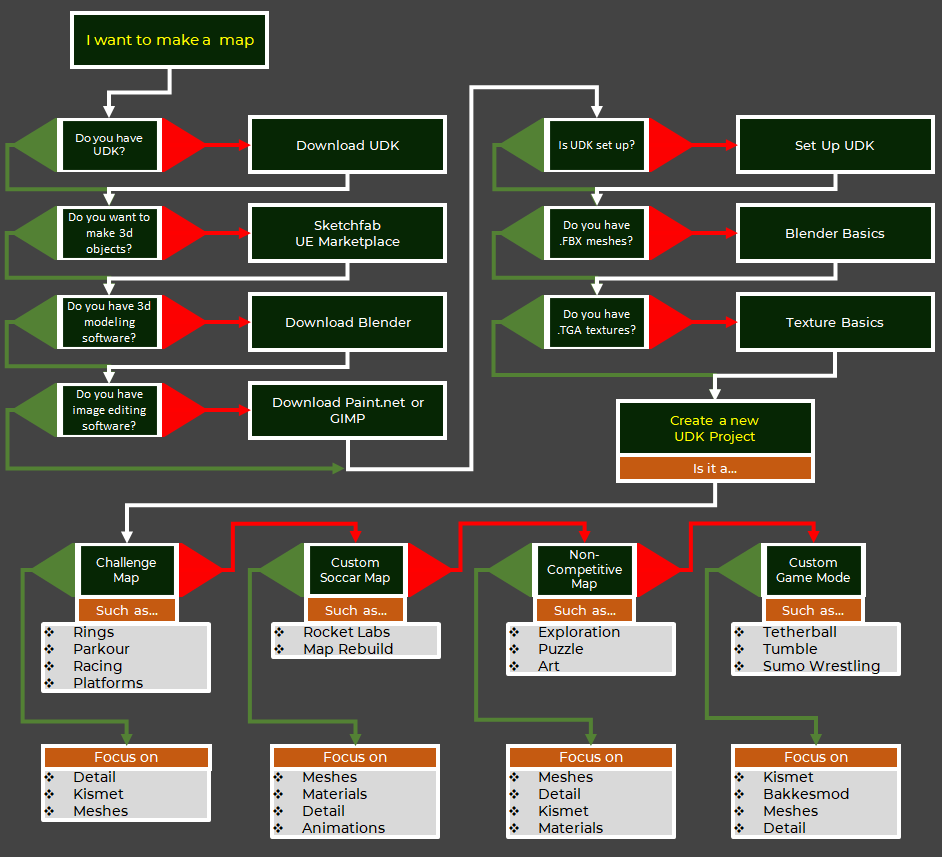

# The Big Picture

It can be hard to know where to start, so here is a flowchart to help you pick the right path. 

**Look for the <Badge text="important" type="tip"/> badge throughout the guide for hot tips you won’t want to miss!**

**Most of this guide will build on itself, so if you are new to this you should not skip too much.**

## Getting Ready <Badge text="important" type="tip"/>

## Getting Down to Business <Badge text="important" type="tip"/>

## Getting Set Up <Badge text="important" type="tip"/>

Soon we will go over the tools and assets you need to get things done. But first, a few brief notes on common points of confusion.