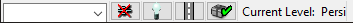
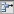
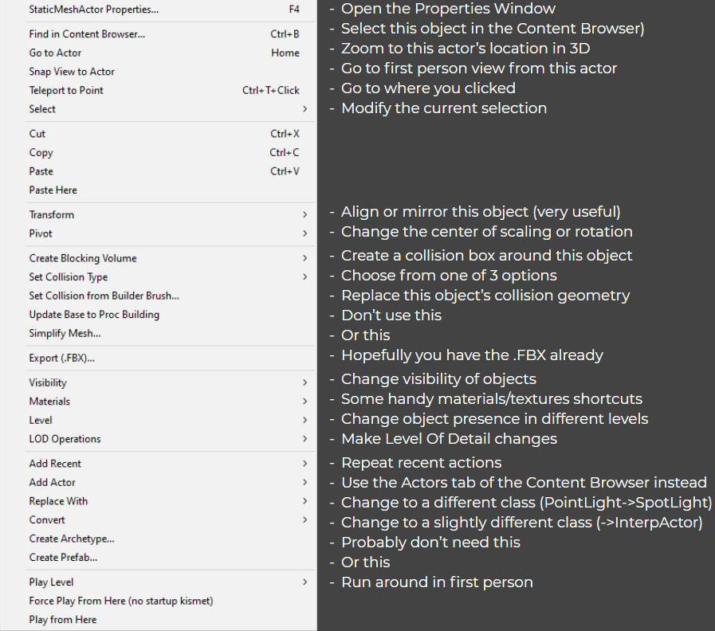

# UDK Basics

## Editor Window

*The main course*

### 1 - Dropdown Menus

* File - Contains what you would expect. **However, CTRL+S IS NOT SAVE. To save, you have to manually click Save. Save All will save any external packages you have also modified. Save Current Level is typically the best choice.**
* Edit - Everything in this menu may also be found in the various toolbars.
* View - **`Browser Windows > Content Browser` to open the Content Browser if you close it.** The options through the middle are reasonably self-explanatory. But, I would like to highlight the `New Viewport` and `Viewport Configuration` options at the bottom. These allow you to have multiple views open, which is a workflow that some people are more comfortable with. **To eliminate part of a split viewport, resize it to 0.**
* Brush - These options are all found in section 11 of the GUI. They build geometry in the viewer.
* Build - This is for finalizing the map. Before you test it in-game, it is always a good idea to `Build Paths`. If you want to see your map in its full beauty, you should `Build Lighting`. Alternatively, you can just `Build All` whenever you feel like it. Building can take a while, but will catch any errors like invalid spawn points or invalid geometry.
* Play - Sadly, this menu is dead to us.
* Tools - Theoretically these are useful, but probably only in very specific circumstances.
* Preferences - Tons of minor quality of life things you can try out. Quality of life is capped at a low level because we’re in UDK, so don’t expect any miracles.
* Help - We’re on our own. Sorry.

### 2 - File Operations

New, load, save, etc. No surprises here.

### 3 - Editor Window Options	

Undo, redo, and then the settings for the manipulator widget. These are to move/translate, rotate, scale uniformly, and scale per axis. The dropdown menu for World/Local changes the coordinate system.

### 4 - Editor Window Actor Search

This can be nice to select specific items which may be buried or misplaced.

### 5 - Useful Popup Windows

These bring up the [Content Browser](08_content_browser.md), [Kismet](../guide/kismet/01_kismet), and [Matinee](../guide/udk/17_matinee) windows. Each of these will be explained in painful amounts of (relevant) detail in their own sections.

### 6 - Editor Visibility Options

The slider adjusts “Cull Distance,” or the cutoff distance for displaying things. You probably don’t ever need to touch it. The button immediately to the right of it allows for selecting objects which have a transparent material.

### 7 - Build/Partial Build Options

Each of these does  a partial build of the world. These all may be found under the Build dropdown menu as well.

### 8 - Mobile Build and Testing

Maybe someday we’ll have Rocket League for iPhone. Until then, this part is useless.

### 9 - Editor Window Shading Options

These change the viewport between various shading modes. In general, you don’t need to ever touch this, because Rocket League is the only place where you can actually see your work in its true form. Right clicking the P button will give a dropdown menu to change the viewport between Perspective and Orthographic modes.

### 10 - Editor Window Mode

For our purposes, you can disregard this. These are probably useful when you’re designing a game from start to finish, but that’s not our goal.

### 11 - Brush Geometry

RIght click any of these to adjust its size. These are for constructing a map in the editor, which is a quick and dirty way of prototyping something. This guide was originally written as a response to every single map being made with only these shapes. I believe that they can still be useful for figuring things out, but they should not be your main strategy for map building because you end up with boring maps.

### 12 - Constructive Geometry Operations

These are the different geometry brush actions you can perform. **Again, Ctrl+S and Ctrl+A are lies in UDK.** It should be illegal to reappropriate commands that every other piece of software ever uses, but here we are.

### 13 - Additional Volume Classes

In here, you can select from a variety of special volumes, from areas with no gravity to custom goals to places where the sound goes wacky. Selecting one from the popout menu will use the brush to create a volume of that type.

### 14 - Selection Visibility Options

These are rather self-explanatory if you mouse over them. Probably the most important one is Show All, to undo those accidental H presses. The Go To buttons are also useful for quickly navigating through a complex level.

### 15 - Project Status

These are general readouts of what UDK thinks of your project. In general, it won’t think too highly of it, but we don’t think too highly of UDK either.

### 16 - Editor Window Draw Scale	

You should probably leave these alone, but you can try messing with them for fun.
### 17 - Grid and Snapping Options	

Sometimes you may want to move or rotate an object by much smaller increments. For some reason, the lower right corner is where these options belong.

## Properties Window <Badge text="important" type="tip"/>

When you have an actor selected and do either `right click > Properties` (the top option), `View > Actor Properties`, or press `F4`, the Properties popup window will appear. This is a huge pile of settings, so the key is to know what you are after and disregard the rest. **The search bar is your best friend.** Keep in mind that this list will be different for each actor type, so it can be good to familiarize yourself with the contents so that you know what to search for. The sections which deal with actually making the map provide some recommended shorthand versions of parameter names for easy searching.

*Almost as much fun as filing your taxes!*

As you mouse over the various buttons on the right edge, the tooltips will fill you in on what they do. However, it can still be a little unclear from their descriptions.

 - Use Selected Object In Content Browser - First, select the material/texture/mesh/whatever you intend to use in the viewer panel of the Content Browser. Then, click this arrow to autofill with its full UPK reference name (such as PhysicalMaterial'TestMap.PhysicalMaterials.StickyWalls').

 - Find Object in Content Browser - Navigates to and selects the listed item in the content browser. This is the easiest way to jump around, because you don’t have to remember where every last material is buried.

 - Clear Text - Wipes this box clean, almost like backspace or delete would do.

 - Remove All Items From This Array - Clear the entire array. In the image above, the array is already empty.

 - Add a New Item - For arrays, such as StaticMeshActors with multiple Materials or a map with multiple spawn points, you may need to manually create open slots. Clicking this will create a slot which has a few more options, as shown below.

 - Create a Copy of This Item - Couldn’t have said it better myself.

 - Remove This Item - As advertised.

 - Insert a New Item Before This Item - Really stunning iconographic work here.

## Right Click Menu <Badge text="beta" type="warning"/>

The entries shown below are for a StaticMeshActor. They will be different for lights and so on.

## General Advice <Badge text="important" type="tip"/>

Try going into an empty project and just pressing literally every button and every key combo you can think of. You’ll learn tons of things about this program. This is also my best piece of advice for learning Blender. **Don’t be afraid of buttons in software.**
