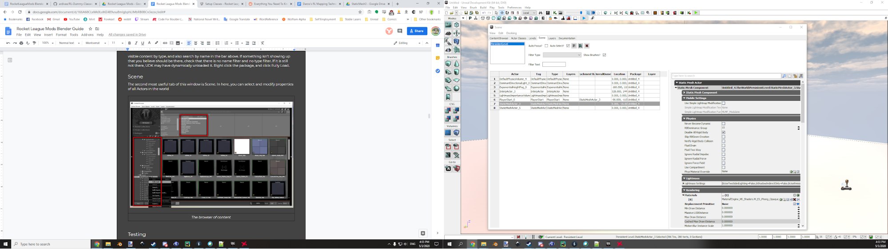
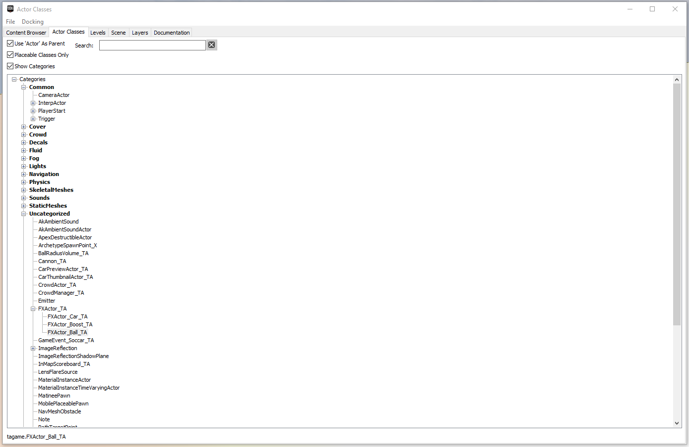

# UDK Basics

## Content Browser

Resources for how to actually use UDK are few and far between (mainly because nobody has used it since 2016), so I will discuss some of the basics here. Things are hidden in menus, with unclear iconography and unclear names, and I can’t cover it all here. Feel free to @me in Discord if you need UDK help.

### Key Terms

* UDK - Unreal Development Kit - For making games in Unreal Engine 3 (like Rocket League)
* UPK - UDK Package - A library of assets to use in UDK
* World - The defining characteristics of everything, like lighting and physics
* Scene/Level - The visible portion of the world (almost all maps will just be one level)
* Actor - Any object within the world
* Mesh - A 3D object made of vertices, edges, and faces
* Material - The surface properties of a mesh
* Texture - A 2D image UV mapped onto a 3D mesh using a material

### Content Browser

First off, you will want to open the Content Browser. If it is not already open, go to `View > Browser Windows > Content Browser`, or find the  button on the top bar. Aside from the actual editor window, this is the single most useful window. If you ever minimize it, it goes to the lower left of your left monitor (which might not even be where UDK is).

*The browser of content*

The first tab, `Content Browser`, is used to browse through UDK packages within the UDK install. The lower left panel allows you to jump between packages. In the upper middle, you can filter the visible content by type, and also search by name in the bar above. If something isn’t showing up that you believe should be there, check that there is no name filter and no type filter. If it is still not there, UDK may have dynamically unloaded it. Right click the package, and click Fully Load.

### Package Management

To make custom maps easier to use, **every mesh/material/actor used needs to be contained either within a Rocket League package (e.g. `Park_P.upk`), a UDK package (given that those have been correctly inserted into `{CookedPCConsole}`), or the map package itself.** Rocket League only knows about objects within the `{CookedPCConsole}` packages, and unfortunately most people who play your maps will not take the extra step of inserting the UDK default packages into their `{CookedPCConsole}` folder, meaning that your map will be sad shades of blue and white. However, it will still function properly as long as all of your mesh objects come from Rocket League or the map package itself.

### Scene

The second most useful tab of the Content Browser is Scene. In here, you can select and modify properties of all Actors in the world.

*The browser of scene actors*

The Properties panel on the right has a search bar at the top, which is extremely valuable for finding the parameter you want to change. **The most common things you will find yourself changing are “location,” “rotation,” and “material”.** This window is great for selecting multiple actors within the scene, and also for editing actors you can’t click (as we’ll encounter in the [Dummy Assets](../guide/udk/14_dummy_assets.md) section much later.

### Actor Classes

Remember the weird Rocket League Dummy Classes folders/files? This is where you can find their contents (given that you correctly made UDK aware of the folders).

*The browser of actor classes*

The easiest way to use this tab is to search for the type of actor that you need to add, then drag it from here into the 3d editor window. For example, each boost pad will need an FXActor_Boost_TA on it to function like we would expect. This is where you would find that.

### Levels and Layers

The Levels tab is, surprisingly, great for jumping between levels. If you choose to use them, they can be a great way to compartmentalize your project. Dribble or aerial control map creators like to use levels to make Easy, Medium, and Hard paths, for example. For most maps, this tab is completely unused.

The Layers tab allows for organizing assets within the same level. It is also completely optional.
