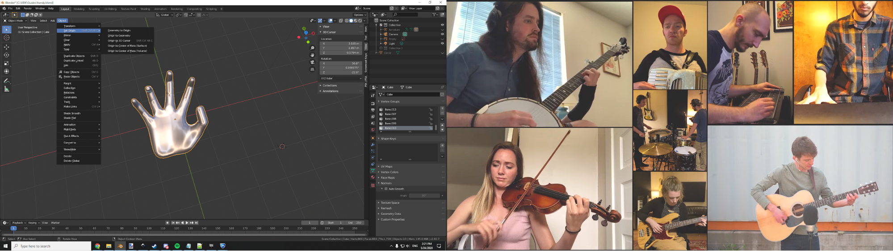

# Blender Basics

## FBX Export

UDK’s preferred file format is called FBX, as you have probably figured out by now. **Any assets you intend to use in UDK must be exported in this format.**

There is one bit of trickery involved with the export, which has to do with a concept called the Object Origin. In Blender, it is shown as a pale orange dot when you have any object selected.

</img>

These are important for manipulating objects in Blender, because any transformation in Object Mode will treat this as the center point. To move this dot, you have a few options under Object > Set Origin (while in Object mode). Typically you want to put it at the location that makes the most sense to serve as a control point for moving around. For a hand, this might be at the wrist joint. For a light pole, it could be at the bottom of the pole. For a sword, that would (hopefully) be inside the handhold.

</img>

However, **the FBX exporter completely disregards the object origin of each object and sets it to the World Origin (0,0,0).** This is both a curse and a blessing. It means that any objects you wish to move around in UDK should all be stacked on the World Origin in Blender. It also means that you can effectively build your map in Blender, export all the pieces, and then move them all to (0,0,0) in UDK to achieve the same layout instantly. **To move an object to the World Origin in Blender, press `Alt+G`**.

<Badge text="important" type="tip"/>
</img>

Check Selected Objects, and deselect every object type except Mesh. Make sure that you have Scale 1, Y Forward, and Z Up. Select a good place to keep it, and press `Export FBX`

Also, once you set these settings, you should click the + button next to Operator Presets and save this as a new preset.

If you see that your mesh has holes in it when you place it in UDK, there are two things that could be going wrong:

* 1) You have face normals that are screwed up, so you should show normals in the 3D viewer and fix their orientations
* 2) You have non-planar faces. UDK cannot even hope to comprehend a face that is bent or curved, so it draws nothing. Everything must be flat. In Blender, in Edit mode, you may either Triangulate Faces (`Ctrl+T`) or `Mesh > Clean Up > Make Planar Faces`

</img>

<Badge text="important" type="tip"/> If you do not see your mesh at all in Rocket League, make sure that you have imported the mesh into the <b>same package in the Content Browser as the map you are working on</b> (e.g. CeilingGoal). Rocket League expects all assets for a custom map to be within the same .UPK.