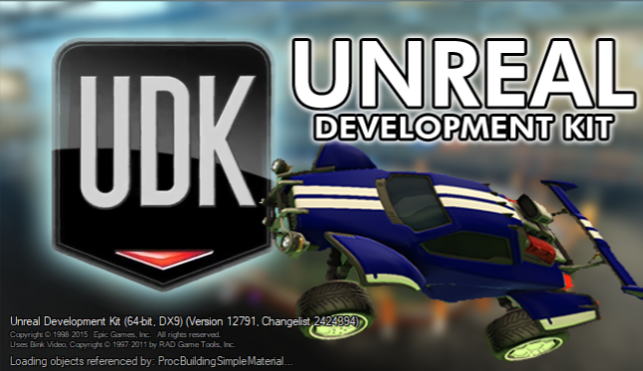

# Miscellaneous

If you installed UDK with (a future version of) the [quick setup script](https://github.com/RocketLeagueMapmaking/UDK_RL_Setup), you may have already opted for some of these changes. Future tools will also streamline this process. Feel free to adjust them to your own preferences, since changing these settings will not require a full recompile. 

:::tip Language
This page is written for the International (American English - `INT`) version of UDK. You can change your language in `Preferences` > `Editor Language` or replace `INT` with the code for your language
:::

## Splash Screen

To replace the UDK splash screen with your own image, save the image as a `.bmp` file (preferably with a size of 650*375), rename the image to `EdSplash` and replace the standard splash screen in \
`{UDK Folder}/UDKGame/Splash/PC/`



## Welcome Screen

If you have disabled the Welcome screen, you can access it in the `Help` menu. Customizing it might just convince you to keep it around:

- In `{UDK Folder}\Engine\EditorResources\WPF\Localized\UnrealEd.INT.xaml` you can change the text and the description of the welcome messages (lines 250-271)
- In `{UDK Folder}\Engine\EditorResources\WPF\Controls\WelcomeScreen.xaml` you can replace the images and the background of the welcome screen with your own images. Replace the current source (in line 13-20) with the path of the image, they can be located in anywhere on your computer
- In `{UDK Folder}\Engine\Localization\INT\UnrealEd.int` you can change the text above the title by replacing `WelcomeScreen_Title` (line 71)

:::warning Changing URLs
For now we are unable to change the URLs. If you solve it, please let us know!
:::

## Map Templates

You can replace the UDK templates with (your own) custom maps templates. Try to keep these up to date with any framework changes as we continue to learn more about modding Rocket League. To save your own map as a template:

1. Open the map you want to have as a template and press `File` > `Save as...`. You can rename it if you want another name, in these steps it will be referenced as `MapTemplateName`. **Change to extension to `.umap`!**. Save it in `{UDK Folder}/Engine/Content/Maps/Templates` (here you will see all the other templates)
2. Go back to the Content Browser and search for the MapTemplateIndex package. You should see all existing templates
3. Right click on the package and select `New TemplateMapMetadata`
4. **Change the name to the same name as the map you saved in step 1 (without the extension)**, so the name would be `MapTemplateName`.
5. Right click the MapTemplateIndex package and press `Save`
6. Take a screenshot of the map and **crop it to 256x256, 512x512 or 1024x1024** (any power of 2 will work)
7. Save the image as a .tga 24 bit texture
8. In the Content Browser, click `Import` and use the default properties to import the .tga texture
9. Double click on the TemplateMapMetadata package for your template map, select your image from the content browser and add the image as a thumbnail
10. Save the package again and exit UDK
11. Open `{UDK Folder}/Engine/Localization/INT/EditorMapTemplates.int` and add the following line (replacing `MapTemplateName` with your own template name):

```int
MapTemplateName=This is what you see in UDK
```

12.  Save the file, close it and open UDK. You should see your own template!

<!-- more than 6 templates? -->

## UDK Tips

In `{UDK Folder}\Engine\Localization\INT\EditorTips.int` you can set your own UDK or mapmaking tips by replacing the text after `Tip_xxxxx=`. Place `\n` for a single line break.

```int
Tip_00001=Did you know you can replace the current tips with your own?\n\nLearn how at https://rocketleaguemapmaking.com/guide/misc/08_custom_udk.html!
```
<!-- more than 50 tips? -->

## Documentation

The [Content Browser](../../essential/08_content_browser.html#content-browser) has a tab for documentation, which you can fill with your own useful links by editing the file `{UDK Folder}\Engine\EditorResources\UDKOffline.html`

## UDK Custom Hotkeys

### Kismet

In `{UDK Folder}\UDKGame\Config\UDKEditor.ini` you can edit [the standard hotkeys](https://docs.unrealengine.com/udk/Three/KismetUserGuide.html#Hotkeys) or add your own hotkeys. **Make sure your hotkey doesn't clash with [an existing kismet view hotkey](../kismet/01_kismet.html#the-hottest-hotkeys)!**

### Matinee

In the Matinee window you may also set your own hotkeys by going to `Edit` > `Configure Keyboard Shortcuts`. You can also just configure them in the same file as the kismet hotkeys (on lines 190-227).

## Menu

## More

If you are willing to dive into the config files and source code of UDK to discover more tricks, please share anything interesting that you find! Let's hope Psyonix uses UE5 to make Rocket League 2...