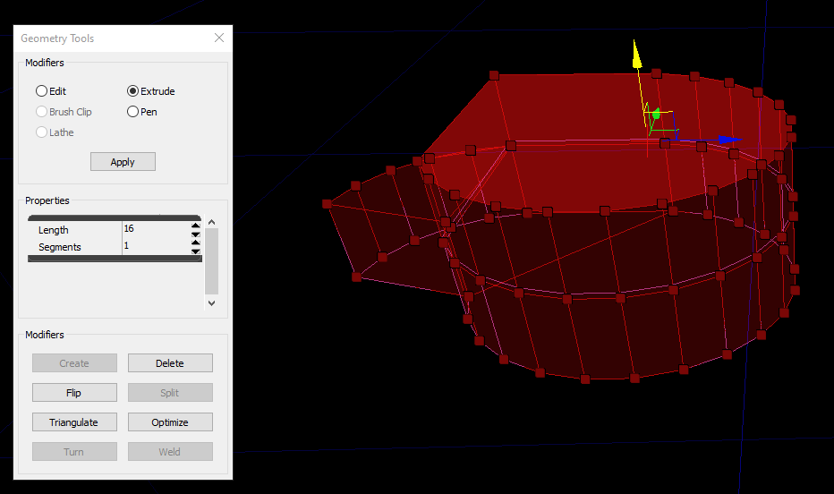

# UDK Basics

## Volumes

Often times you will want to trigger events when a player enters a certain area. On a Rings-style aerial control training course, maybe you want to teleport the player back to the last checkpoint if they miss a ring. Perhaps you want to change the lighting of the map in some sort of control panel.

Similarly, maybe you want to invert gravity in part of the map, or have invisible walls. There are over 30 types of volumes in UDK, so please experiment with any that sound interesting, but some of the most useful ones will be described here.

* `TriggerVolume` - Run Kismet when the player or ball enters this volume
* `DynamicTriggerVolume` - Same as a TriggerVolume, but this may be moved by Kismet
* `GoalVolume_TA` - If the ball enters this volume, a goal is counted
* `GravityVolume` - Adjust vertical gravity within this space (or invert to give a floating effect)
* `LightmassImportanceVolume` - Require higher fidelity on lightmaps in this region
* `PostProcessVolume` - Adjust colors or apply affects

Keep in mind that these volumes are not allowed to move, unless they have Dynamic at the start.

## RBCC

Rigid Body Collision Channels, also known as Red Bull Cubic Centimeters (not really), are a way to change which types of actors a StaticMeshActor or a BlockingVolume will collide with. In general this should stay set to RBCC_Default, but there are times when you need specific collision types. Some examples of this in-game:

The net in Hoops, which players may drive through but the ball hits
The (revealed) floor in Dropshot, which the ball may pass through but players hit

If the UDK setup process went correctly, there should be three new entries in addition to the 15 already in there:

* RBCC_Ball
* RBCC_BallBlocker
* RBCC_VehicleBlocker

Hopefully the latter two are self-explanatory. RBCC_Ball seems to be nearly identical to the default, but perhaps with greater precision applied to the collision calculations.

To create objects which have these collision properties, open the Properties window of a StaticMeshActor or a BlockingVolume. **Set the same parameters for a normal collision (uncheck Disable All Rigid Body and check Block Rigid Body). Then, search for “rbc” and select one of the RBCC options from above.**

## Custom Brushes - Geometry Edit Mode

The standard Brush shapes should cover 95% of Volume needs, but there are a few ways to create truly custom volume shapes.

The first is using the Geometry Edit mode that is built into UDK. After using this extremely impressive and capable tool, you will never want to use Blender again.

**Right Click the default shape closest to your target shape.** This will bring up a window with a few adjustable parameters. The most important value is the number of Vertices/Sides/Faces so that you don't have to create vertices/sides/faces yourself later.

Make sure the brush is visible by pressing `B`. It may overlap existing volumes or geometry.

**Enter Geometry Mode with this button in the top left of the UDK window (or press Shift+2).** This will reveal a small Geometry Tools window with a few different modes of operation. Generally, you will only need `Edit` and `Extrude` to get the maximum utility out of this.

Clicking on the brush, you should see an array of vertices that respond to left clicks. `Ctrl + Left click` will select multiple vertices. Or, if you want to do some hand stretches, `Ctrl + Shift + Alt + Left click drag` will perform a box select.

")

Move, rotate, and scale it to your needs! **Remember that `Ctrl + Z` does not work in this mode. You will have to click the Undo button on the top toolbar.**

If you wish to create additional geometry, switch to the `Extrude` mode.

**Select a face by clicking on it, then use the move tool to extrude a new region of the brush.** Again, you will have to click the Undo button if you get it wrong.

## Custom Brushes - Brush Import

For truly custom brush shapes and precise control over the brush shape (not to mention repeatability and reusability), the best strategy is to make them in 3D modeling software such as Blender.

UDK is able to use **.DXF** files as inputs to its brush system. This is a filetype originally created for AutoCAD, but is a widely used standard supported by most 3D software. For whatever reason, Blender's .DXF exporter produces very small models, so you should **scale brushes by 100 before exporting.**

**At the bottom of the Brush menu, click `Import...`**. Find your brush and import it. If you don't see it, try pressing `B` a few times to hide and unhide it.

You are now able to add volumes in whatever wacky shapes you want! There might be reasons you want hollow TriggerVolumes, or GravityVolumes shaped exactly to fill parts of your map.
