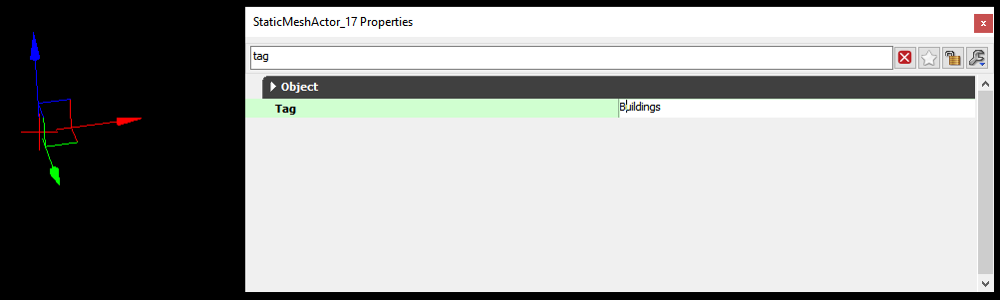
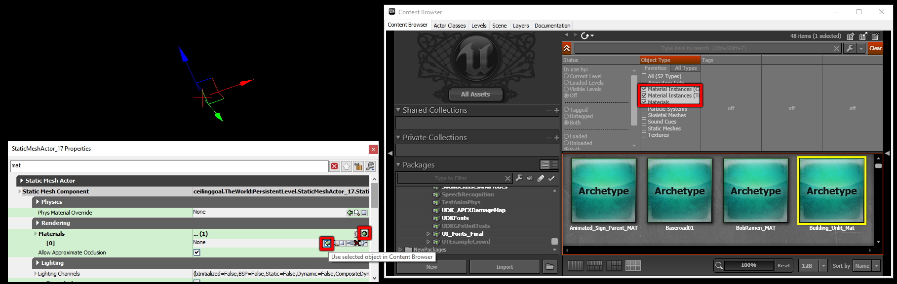

# UDK Advanced 

## Dummy Assets

This is perhaps the most important section in this whole guide, yet it’s never been written down in a very intelligible or collected fashion. I feel it’s important to understand [basic mapmaking](../../essential/01_flowchart) (i.e. everything leading up to this point) before attempting this, because this is where it starts to get really weird. Dedicated modders finally cracked the code in 2017, which allows for any map maker to use any in-game asset. The trick?

Just name it correctly.

## Download

[This GitHub repository](https://github.com/Martinii89/RL_DummyAssets) is a massive library of essentially blank objects with weird names. Thanks to the dedicated work of Martinn (show him some love if you encounter him in the wild), this is a nearly complete list of all assets within Rocket League, properly sorted into their respective UPKs, groups, and subgroups.

</img>

**Click that friendly green button and place this .zip in the same location as the Park_P.upk file that you have been working with. Extract it, then look for it in UDK.**

It’s also worth mentioning that there will be a name clash between the pre-existing Park_P.upk and the new one inside the Dummy Assets folder. **If you would like to keep using your less-dummified Park_P.upk, you will need to move, rename, or delete the one inside DummyAssets/Maps/BeckwithPark.** 

## How Dummy Assets Work

Thankfully, the reason the Dummy Assets approach even works is the same reason that we are able to create custom maps for the game. **Rocket League is essentially a collection of folders,** much like the list of packages within UDK’s Content Browser. In fact, each map within CookedPCConsole is an Unreal Package (.upk file), so it is exactly like this.

Recall that the word “Cooked” refers to the fact that these packages have been encrypted. This means that the Dummy Assets method is not as simple as copying Dropshot out of CookedPCConsole and opening it in UDK, but it is nearly that simple. **Martinn** took the time to pass all of the Rocket League maps through a decryption tool (discussed [later in this guide](../decryption/assets)), and then organized the resulting pieces into this library.

Most map names should be obvious, especially with the renamed folders. Here is a list of some key names used in UDK/UPK files versus what you will encounter in the game:

|UPK/UDK item named this...|Becomes this in the game...|
|------|------|
|_P|The playable portion of the map|
|_OOB|The out-of-bounds portion of the map|
|_SFX|Sound effects|
|_MapImage_SF|Thumbnail (e.g. when browsing Training)|
|Park|Beckwith Park|
|Stadium|DFH Stadium|
|EuroStadium|Mannfield|
|TrainStation|Urban Central|
|Underwater|AquaDome|
|Farm|Farmstead|
|CS|Champion’s Field|
|ShatterShot|Dropshot|
|HoopsStadium|Dunk House|

:::warning Utopia
Also keep in mind that there is a stadium named `Utopia Stadium` (the idyllic coliseum with the globe fountain) as well as a Rocket Labs map named `Utopia Retro` (the donut). **For testing, we will continue to overwrite the donut Utopia.**
:::

One confusing aspect of all of this is that Rocket League does a fair amount of asset sharing internally anyway. Materials within the Stadium_OOB.upk package might get reused in Park_Night_P.upk, **but this is the whole reason that this strategy works.** Rocket League will check in all of the packages within `CookedPCConsole` for the meshes, materials, textures, and whatever else you reference within your map. 

:::danger NOTE
**It is important that all NEW assets (meshes, materials, textures) for your map live specifically within the map package itself and not a supporting .UPK or .UDK file like Generic or Simplicity. Dummy Assets should stay exactly where they are.**
:::

A powerful workflow is to create packages of reusable assets, then copy them into the specific map project and reassociate the meshes in the map with the new package. This also spares you from UDK's "smart unloading" feature, where it will remove any objects from a package which appear "unused," even if you literally just added it and saved.

## Dummy Static Meshes
As mentioned, these are essentially blank objects. You will find meshes with no vertices, materials with no visibility, and textures with no pixels. Therefore, you should take a few extra steps when building a map with them. **There is also going to be a lot of trial and error involved, so be patient.**

</img>

**First, you will need to right click a package in the Content Browser and select Fully Load.** This will make all of the contents available in the editor. **Avoid Fully Loading all of the Dummy Assets unless you are patient and have a very high-end computer, otherwise you will probably crash UDK.**

</img>

**Drag a StaticMesh asset into the map,** or right click in the 3D Editor and select `Add StaticMesh: ...`
:::tip
**Before doing anything else, give it a useful name in the Tag field of its Properties.** This will make it possble to find this object later, since it has no physical representation within the editor.
:::

</img>

**The Scene tab of the Content Browser will only update after saving the map. Sort by the Tag column by clicking on it, and any named Dummy Assets will appear in alphabetical order.** The panel on the right of this window will allow you to edit all of the same properties that are accessible within the F4 popup window. If you wish to use that window instead, **selecing the object within the Scene tab will make it the active selection within the 3D Editor as well, meaning that you may simply move your mouse and press F4 to bring up the Properties window.**

**Also keep in mind, from the floor collision section way back when, that most of these Static Meshes will have collisions completely disabled, and there isn’t anything you can do about it.** Not with just this approach, anyway.

Generally, when rebuilding a map purely with these assets, you will need to place a mesh both for visibility and for collisions. **Dummy Assets are more useful as world detail and for materials.**

## Dummy Materials
Dummy materials work in the same way, but must be applied using the friendly green arrow.

</img>

**Most Dummy Assets will not have any available material slots, so it will be necessary to click the green plus button under Materials first.** Additionally, it can be hard to know which materials go in which slots of which Dummy Assets, as the names are not 1-to-1 and there may be multiple slots.

To further complicate matters, many of these materials will simply not work on certain types of objects. Some are meant for particle systems, others for volumetric effects, and others are controlled by code within the game that we have no way of accessing. For this reason, I recommend testing materials on what I generally refer to as UV cubes. The CSG brush will work fine for this, or you can create and import your own that will be more useful. Or, take mine:

[This is for you](https://drive.google.com/file/d/1sS6KkDMfkzkhJfuBMicUa56FpdiDXvO-/view)

</img>

**Assign a Dummy material to slot one, and check it out in game.** The best part about this is that you can then “close the loop” and adjust the UV map of a custom mesh to fit parts of this, based on a screenshot. I also recommend placing multiple cubes at once to test a wide range of materials.

</img>

This won’t be a perfectly easy process, unless you get the screen capture lined up 100%. But, it can be fun and unlocks a whole world of possibilities. This brings us to the next important point: how to iterate and improve your map.