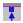

# UDK Advanced

## Introduction 
Kismet is a node-based programming system that presents a “cleaner” and “easier to use” interface than you would get writing your own code. Logical blocks take the place of code classes and functions, and lines on the page indicate data and program flow.

Kismet, much like the [CSG tools](../modeling/csg), is not meant to be used to program a whole game. It is meant more as a tool for cheap and dirty testing, but in this case it is the only option we have.

### Key Terms
* `Node` - A Kismet code snippet, represented by a shape with labels on it
* `Sequence` - A set of Kismet nodes packaged to appear as a single node
* `Link` - An input or output of a Kismet Node
* `Connector/Connection` - A line connecting two Kismet nodes, indicating logic or data flow
* `Object` - A Kismet reference to something in the map

The terms Link/Connector/Connection are used somewhat interchangeably, but they are closely related.

### The Hottest Hotkeys
* `Left click` - Pan around the Editor
* `Right click` - Add nodes to the Editor
* `Scroll wheel` - Zoom view
* `Alt + Left click` - Destroy connector between nodes
* `Ctrl + Left click` - Select multiple nodes
* `Ctrl + Left click + Drag` - Move node(s)
* `A` - Zoom to fit selection
* `Ctrl+A A` - Zoom to all nodes (if you’re ever hopelessly lost in the void)
* `C (with node(s) selected)` - Add comment block

### Kismet Editor Window <Badge text="important" type="tip"/>

*Nice and simple*

1 - Toolbar - Various useful-ish functions, all in one place:
 - Go back to the previous sequence
 - Go forward to the returned-from sequence
 - Go up one sequence level
 - Rename the current sequence
 - Zoom to selected (`A`)
 - Hide node’s unused connectors (also in a node’s right click menu)
 - Reveal all of node’s connectors (also in a node’s right click menu)
 - Search for nodes to place
 - Search for nodes already in editor
 - Update the list of nodes
 - Open a second Kismet window

2 - Node Editor - Place, move, and interconnect nodes

3 - Properties - Edit internal variables and functionality of nodes

4 - Sequences - Jump between sequences
