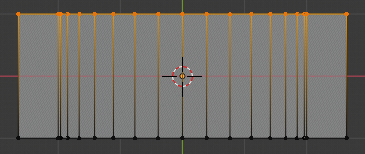
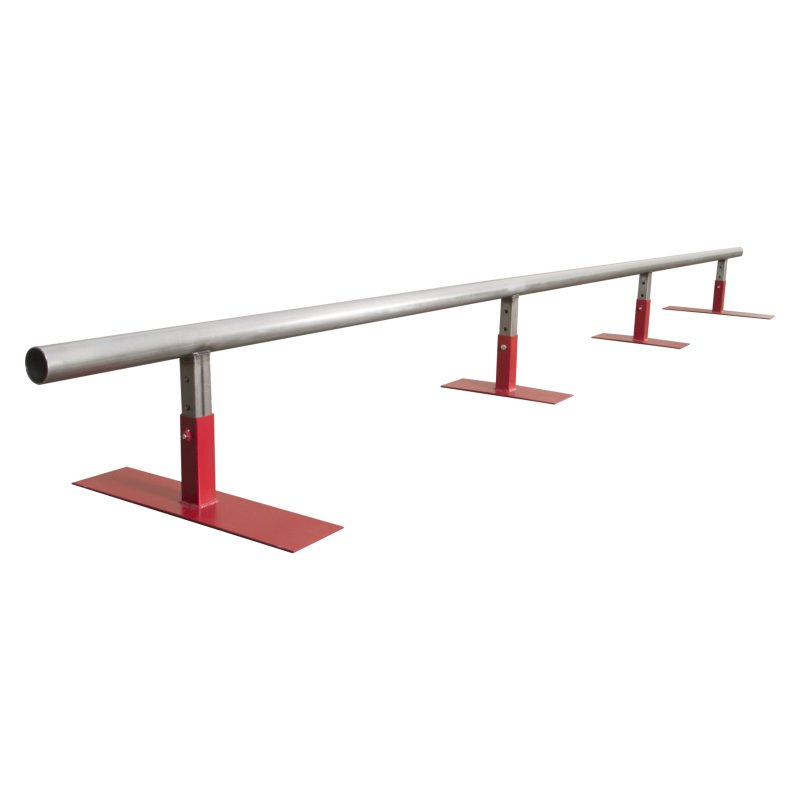
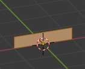
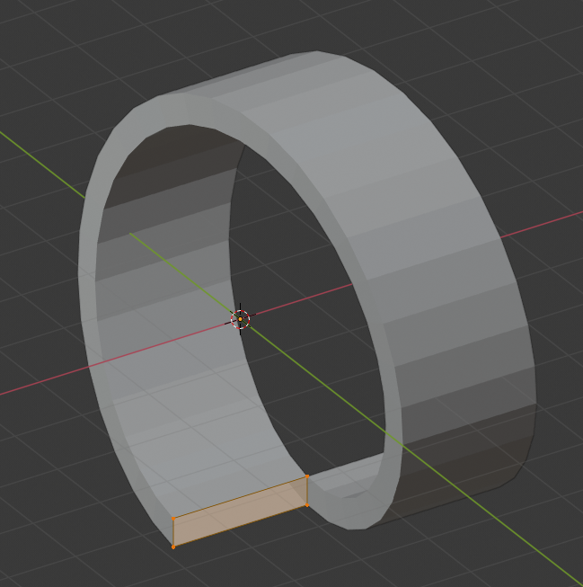
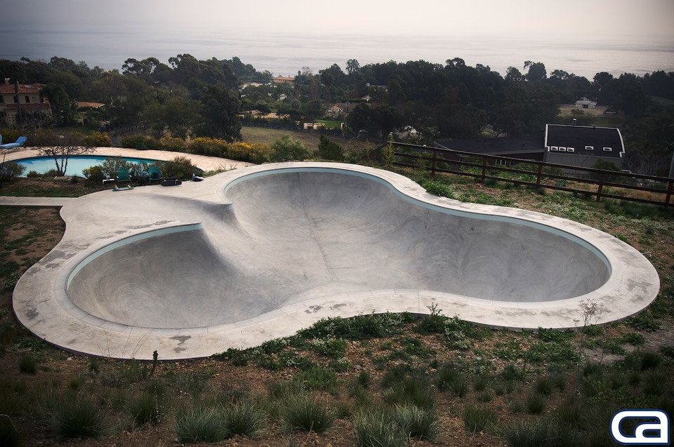
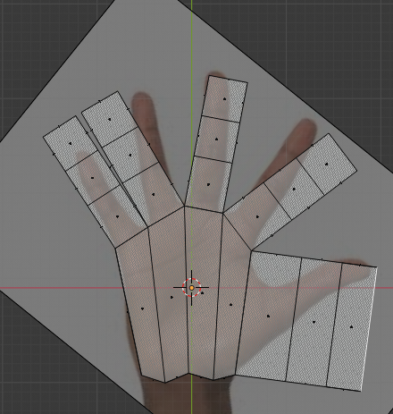

# Blender Basics

You can make anything in Blender, given enough patience and time. This guide is both impatient and rushed, so we will get straight to cranking out map assets.

Let’s start with easy assets for a skate park. We’ll make a box ramp, a halfpipe, a rail, and a loop

*These are healthy X-Rays*

## Model meshes

**Enter Edit mode, and click the Toggle X-Ray button in the top right of the 3D Viewport.** This will allow you to select geometry which is “behind” other geometry. Occasionally it is helpful to turn this off, but try to always be aware of which mode you’re operating in.

:::details Simple mesh - Box Ramp

*Let’s get down to business*

**Press `A` to select the whole cube. Go to front view with `Numpad 1`. Then press `G`, `Z`, and type `1`.** This should move the entire cube up one big gridline, so that the small pale orange dot (object origin) is centered on the bottom face.

**Press `.` (Period/Full Stop) to bring up the Pivot Point wheel, and choose 3D Cursor.** If you have moved the 3D cursor away from the center of the world, press `Shift+S > Cursor to World Origin`.

Press `S` to scale this cube. Type 2 for a scale of 2. You should see it scale up and away from the 3D cursor. Press Alt+A or A twice in quick succession to deselect all.

**`Left click` + Drag a box around the bottom vertices of the cube. Press `S` to scale, then `Y` to restrict it to the Y axis, and then `3` for a scale of 3.**

Feel free to adjust the height as you see fit by moving the top vertices in the Z axis. I’m calling this good enough. **Press `H` to hide it, and let’s make another asset.**
:::
:::details Simple mesh - Halfpipe
**Press `Shift+A` and add a Mesh > Cylinder.** You can configure it in the bottom left of the 3D Viewport, but the defaults will be good enough for our halfpipe.

**Enter edit mode, select all, and type `R X 90` to rotate the cylinder by 90 degrees about the X axis. Move it up above the object origin by typing `G Z 2`.**

**Select the top half of the cylinder (not including the vertices at the halfway line). Press `X` to delete. Select what’s left and scale along X by 2.**

**Select the top edges, press `E` to Extrude. Right click to return the vertices to their starting point. Press `S X` to scale in the X axis. Left click when it looks like a good width.**

**With the same edges selected, press `E` again, then `Z`. Drag them down near to the base line. Press `F` to create a new face using the selected vertices.**

Now we just need to make it a closed object, and we’re done.

Go to top view with `Numpad 7` and box select one edge of the halfpipe. Press `F`` to create a face with these vertices. Do the same to the other side.

Blender supports rendering faces with an arbitrary number of sides. But, UDK does not. **It only does triangles**. So, we need to convert these crazy side faces into triangles.

**Press `Number Row 3` to change to Face Select mode. Select each side face (the face centers are small dots which are probably floating in the air). Press `Ctrl+T` to Triangulate Faces.** Adjust the width if you would like. Once it looks good enough, **`H` to hide it, and let’s make a rail.**
:::
:::details Simple mesh - Rail
We are going to start with a cylinder again, but this time we’ll change some of its properties.

**Set Vertices to 8 (or just a number considerably lower than 32). In Edit mode, move the cylinder up 1 meter. Press `S Shift+Z` to scale while constraining the Z axis.** We’re trying to make a narrow pole for the rail supports.

**Go to top view with `Numpad 7`. Press `Shift+D X` to duplicate and move the pasted vertices along the X axis. Create a line of these poles.**

**Return to Front view. Duplicate the middle pole, rotate it 90 degrees, and move it up. Scale it along the X axis so it touches all of the support poles. Hide this, and now to make a loop.**
:::
:::details Simple mesh - Loop
This time we’ll start with a Plane. Rotate it up on end and move it up just like before (see Box Ramp)

**Scale it to a fraction of its height in the Z axis. Return to Vertex Select mode with `Number Row 1`.**

**Add a Screw Modifier in the Modifier tab of the Properties Window. Increase the number of steps, and set Screw to 2 or -2.** This will take the contour we have defined and spin it around in a corkscrew. As is, it doesn’t look like much fun to drive on.

**Grab the rectangle and move it down in the Z axis to wherever looks good. Exit Edit Mode and press Apply on the Screw Modifier.** This creates editable geometry for the whole loop. **Move the whole loop up so that the upper edge of the end faces is level with the X-Y grid. Lastly, fill in the end faces of the loop.**

:::
:::tip
These objects are ready to import into UDK. Feel free to skip ahead to the Blender to [UDK section](../guide/), and then return to here for more advanced Blender modeling tips.
:::
:::details Advanced Mesh - Wacky Skatepark Bowls

Cool, now you can make boxy things. Every multiplayer map in Rocket League has very rounded edges everywhere, so wouldn’t it be nice to be able to make something like that?

The easiest way to visualize how to make this is to picture topographical lines (lines of equal height) running around whatever object you wish to make. That gives a very clear indication of what geometry you need to create.

**Add a Circle, then move it away from the origin either on X or Y. Duplicate it, and rotate the copy 120 degrees. Repeat. Delete the vertices near the center of the whole object. Select end vertices of different partial circles and create an edge using `F`. Once you have a closed shape, fill it with a face also using `F`. Press `I` to inset a face inside the newly created face.**

Repeat the process a few times to get a kind of grid within the circles. Once the inset face is self intersecting, select the crossed vertices and merge them with `Alt+M`. Select the faces with more than 4 edges, press `E` to Extrude them, then right click to stop the action. Press `Alt+M` and select Collapse to create triangles within these faces.

Press `O`, or click the Proportional Editing Enable button on the top bar. Set the mode to Sphere (since these are kinda spherical). Move them in the Z axis, adjusting the area of effect of the proportional edit using your scroll wheel.

**Select any harsh edges, and press Ctrl+B to Bevel them. Spin the scroll wheel up a few ticks for more bevel steps.** Similarly to when we inset faces, if the bevel causes self-intersecting faces, you will need to merge the guilty vertices.

Lastly but not leastly, there are a number of mesh cleanup steps that you should always take before calling your mesh complete.

1. Angle-Based Smoothing - **Go to Mesh > Shading > Smooth Faces. Under Object Data > Normals in the Properties subwindow, enable Auto Smooth with an angle around 45.** This will smooth the shading over any faces which are at less than a 45 degree angle to one another.

2. Remove Duplicate Vertices - **Go to Mesh > Clean Up > Merge By Distance.** This removes any vertices that are in (essentially) the exact same location as others.

3. Normals - **Enable face normal lines at the bottom of Viewport Overlays. Press `Alt+N` and either Flip, Recalculate Outside, or Recalculate Inside based on your needs.** In UDK and Rocket League, these faces will only be visible from the side the line is pointing out of, so be sure that the normals are right.
:::
:::details Advanced Mesh - Human Hand
There are a few ways to approach a more complicated shape. The best approach depends on exactly what you are trying to create, and there is no single right answer. **When modeling a more complicated object, reference images and sketches are key.**

There are at least 15 pictures of hands on the internet, and it should be possible to find good reference images for almost anything.

**Drag an image file into Blender, or add an Image > Reference while in top view. Reposition it, rotate it, and I recommend adjusting Opacity down below 0.5.**

**Add a cube, and adjust it to be generally the shape of the palm of the hand. Press `Ctrl+R` to do a Ring Cut, and spin the scroll wheel to add 3 cuts.** This is to create faces from which to extrude fingers. **Finesse the vertex placement again.**

**Select the faces at the base of each digit. Go to the Face menu (or press `Ctrl+F`) and click Extrude Individual Faces.** This will create distinct geometry out from each selected face. **Repeat this two more times for each finger segment.** We’ll turn the first thumb segment into a part of the palm, so it’s okay to have 3 segments there too. **Finesse everything again, placing edges across knuckles and joints.**

This is where it all gets a little subjective. **Adjust the height of the hand and fingers to give them a more realistic shape. Select the fingertip faces and press `Ctrl+B` to Bevel them, which will give a more rounded appearance.**

We need to add a little more geometry to everything. **Select the knuckle edge loops and Bevel them. Using the Knife tool (on Cut Through mode), add two lines across the palm. Delete the face between the thumb and pointer finger, then create new faces with the Fill tool (`F`)**. Finesse everything again, along all 3 axes. It’s still going to look boxy, but we are about to fix that.

**Add a Subdivision Surface modifier in the Modifiers tab of the Properties window. Set Viewport to 2 Subdivisions.**

**Select the edges where each of the fingers meet, and perform a Bevel. This will make a 6-sided face in the middle, so for each of those you will need to select vertices on opposite sides of the face and Join (`J`) them with an edge.**

**Remember to adjust the back of the hand, to give it some curve and visible knuckles. Select the whole mesh and go to Mesh > Shading > Smooth Faces.** While in the Solid Viewport Shading Mode (solid circle in the top right), you can click the dropdown arrow to apply a MatCap to the object. These are a great way to get a better feel for how your mesh actually looks.

Now, let’s make the hand do something interesting. **Move the 3d cursor to the base of the hand (`Shift+Right Click`). Add an Armature. Move the root bone so that it is entirely outside of the hand. Extrude (`E`) the rest of the bones, lining them up as best you can to hand joints. Exit Edit Mode, select the hand, `Shift+select the armature`, and press `Ctrl+P` to set the hand’s parent to the armature. Select Add Automatic Weights.**

**Switch to pose mode, and strike a pose! You will also need to Apply the Subdivision modifier before exporting.** I recommend creating a copy of (and hiding) meshes before applying any modifiers, so that you have a backup in case you decide you want an extra finger or something.
:::

## Key Takeaways <Badge text="important" type="tip"/>

- Hotkeys are your best friends
- Start with a base mesh that makes your life easier
- Ring select (`Alt+click`), Box select (`B`), and Circle select (`C`) are wonderful
- Make the most of the 3D cursor
- Bevel (`Ctrl+B`) is a great tool for making rounded edges
- Proportional Editing (`O`) is great for making strange, curved surfaces
- Subdivision Surface Modifiers can help you smooth everything
- Always use Angle-Based Smoothing
- Use modifiers like Mirror or Array to minimize the amount of work you have do while also doing it better
- Use reference images and sketches when possible
- Matcaps are a great way to view your meshes

Have fun! Blender is great!